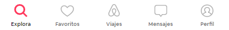

<!-- REPO TITLE -->
<br />
<p align="center">
  
  <h4 align="center">Covered | Technical task</h4>
    <p align="center">
    <a href="https://framer.com/projects/covered-frontend--PHpWlGWg0EqwOqFUhEJe-954bw" target="_blank">Framer prototypes</a>
    ·
    <a href="https://covered-frontend.vercel.app/" target="_blank">Live Demo</a>
  </p>
</p>

<br />
<br />


- [About the assignment](#1-about-the-assignment)
- [Installation and start](#2-installation-and-start)
- [Design process](#3-design-process)
    - [background](#background)
    - [brand identity](#brand-identity)
    - [Interaction and visual design](#interaction-and-visual-design)
    - [references and tools](#references-and-tools)
- [Development process](#4-development-process)
    - [codebase](#codebase)
    - [key points](#key-points)
    - [built with](#built-with)
- [P.S](#ps)


&nbsp;
<!-- ABOUT THE PROJECT -->
### 1. About the assignment
Create an minimalistic online member card for our premium clients.
On this card they can see:
- their personal contact at covered with  name, email phone and whatsapp link.
- an excerpt of their current booking with a link to all booking data.
- loyalty points  
- all info should fit in screen (iPhone 8 plus)
- a personalised offer for up-sell (rent a boat / hire a chef / Champaign brunch etc.) *optional
- if you have other ideas, go ahead. *optional


&nbsp;
### 2. Installation and start
To get a local copy up and running follow these steps:

1. Clone the repo
   ```sh
   $ git clone https://github.com/francoromanol/covered-frontend.git
   ```
2. Install packages
   ```sh
   $ yarn install
   ```
3. Run
    ```sh
    $ yarn dev
    ```

Once started the client app should be available via [localhost:3000](http://localhost:3000).


&nbsp;
### 3. Design process
* [User card mobile](https://framer.com/share/covered-frontend--78DsQ3KMZTUp2a0FOnqd/tCVgMXuOw)

* [User card desktop-prototype](https://framer.com/share/covered-frontend--78DsQ3KMZTUp2a0FOnqd/NjbIBXBjR)

* [Reservation prototype](https://framer.com/share/covered-frontend--78DsQ3KMZTUp2a0FOnqd/U74ZgE7vE) - just an idea to show the offer for up-sell and a possible layout for a booking information page.

* [Framer file](https://framer.com/projects/covered-frontend--PHpWlGWg0EqwOqFUhEJe-954bw) - you can check other options that I worked on.


#### Background
Covered has a clear, clean, lightweight and presentable design. The page should provide an effortless, intuitive and smooth user experience.


#### Brand identity
I used [Josefin Sans](https://fonts.google.com/specimen/Josefin+Sans?preview.text=Te%20tenemos%20cubierto&preview.text_type=custom), an open source font as an alternative to the covered font (grotesque).

About the color palette, the covered #e1817c HEX color was preserved on details such as the avatar and some texts details, in this last case lightly changed due to accesibility concerns (contrast).


#### Interaction and visual design
The idea is to divide the user card into scalables – in the future and with more data – easy and readable sections that summarize the key features of the product:

  * Client information
  * Booking card
  * Contact information

This structure provides the user an intuitive layout where all their information is visible (and fit) on the screen and where they can see an excerpt of their current booking with a link to all the booking data.


#### Other ideas
About the personalized offer for up-sell, I came to the conclusion that a link into the card was clear enough for this page and then show the offers on the booking data page (like airbnb or ryanair) --> [Find a simple example layout on this link](https://framer.com/share/covered-frontend--78DsQ3KMZTUp2a0FOnqd/U74ZgE7vE)


About other ideas, I though that it would be nice to have a preview image of the villa in the reservation card, so the card component is mantained from the rent villas page and this gives a visual identity across diferentes stages. I also added an "Our villas" link in the navbar and an Avatar with the initials of the client that would work as a dropdown menu.

As an idea for the future, I would propose a bottom navbar on the mobile version (such as the airbnb one) since it gives a good and more real mobile experience and a page for the reservations and other for the client profile:
<div align="center">
  
</div>


#### References and tools
* [Material design](https://material.io/design) as a reference for design decisions (fonts, spacing, components).
* [Framer](https://framer.com) for wireframing and design. It's a very useful and powerful tool since its made with react and it gives me the posibility to code the components inside a design tool (like Figma) and then export and import them in React easily. It's also a very nice tool to create a design system for the product and then move it to [story book](https://storybook.js.org/).


&nbsp;
### 4. Development process

[Live demo](https://covered-frontend.vercel.app/)

The stack is next.js + styled-components. I am aware that it is an over-engineering for a page of these characteristics but I also understand that we would work with react / vue so it seemed correct to show my workflow and knowledge on a JavaScript framework.


#### Codebase
Organization structure: Since it was a simple project I keep it simple but If grows I would go with an [componentes-container solution](https://betterprogramming.pub/how-you-should-structure-your-react-applications-e7dd32375a98).

Components: all components are stateless and propTypes is provided only on the Navbar and ClientCard (lack of time).

Icons: there were only 3 icons so I didn't use a library, that's why there are 3 icon components.

styled-components: since the components were not big I declare the styled within them so that the component is isolated and if there are duplicate components we can create a shared styled folder ([see example](https://github.com/francoromanol/covered-frontend/tree/main/components/styled)) and import them from there.


#### Key points
 * Semantic elements.
 * Worked on accesibility.
 * Lighthouse report on perfect score.
 * SEO: only the user accesses so I did not give it importance.
 * Responsive design that works with mobile, tablet and desktop.
 * Function to get formatted date (from timestamp).
 * Function to get formatted phone from contact.
 * Tests: It would be nice to make tests but I have omitted them due to lack of time.


#### Built with
* [Next.js](https://nextjs.org/)
* [styled-components](https://styled-components.com/)
* [Vercel](https://vercel.com/) for deployment.


&nbsp;
### P.S
Hi Thomas and Preetam,

Sorry for the delay and thank you again for the two weeks, I was very busy and it was helpful.

I would like to clarify that with more time and in a real scenario I would probably make a conceptual presentation (with framer-indesign) to explain the design process.

I hope these notes are useful for you to read the exercise. If there is something that is not very clear, ask me and I will try to clarify it. I would love to receive your feedback!

Have a great week!

[Franco Romano Losada](mailto:francoromano1994@gmail.com)


<!-- MARKDOWN LINKS & IMAGES -->
<!-- https://www.markdownguide.org/basic-syntax/#reference-style-links -->
<!-- [product-screenshot]: readme/recording.gif -->
